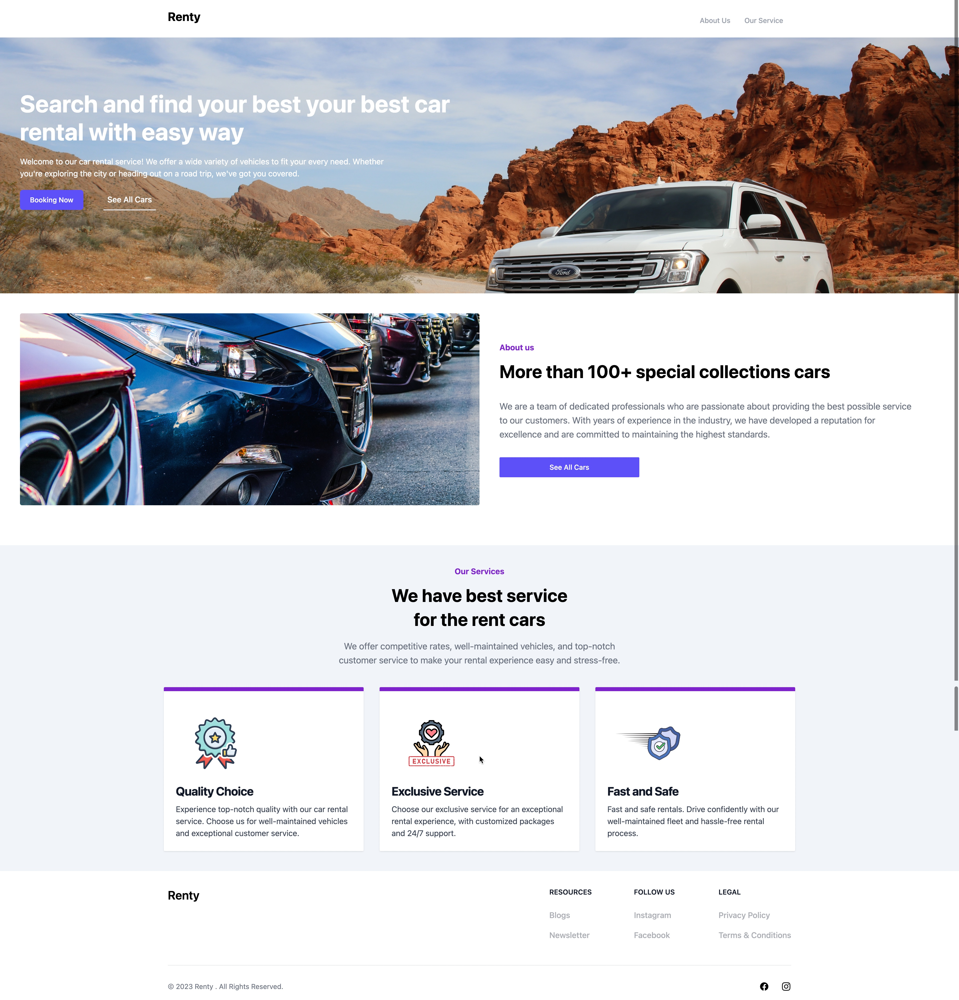

# Rent Car API

With the Rent Car API, developers can retrieve real-time data on available cars, including car name, brand, image, price, type, color, and availability status.

## Tech Stack

**Client:** React, TailwindCSS

**Server:** Laravel

## Documentation

The REST API to the rent car app is described below.

### Get list of things

#### Request

`GET api/rentcars/`

    http://localhost:8000/api/rentcars

### Response

    HTTP/1.1 200 OK
    Date: Thu, 24 Feb 2011 12:36:30 GMT
    Status: 200 OK
    Connection: close
    Content-Type: application/json
    Content-Length: 2

    []

## How to clone ?

**Backend**

- Clone this project using https or ssh
- So the api is using Laravel

```
composer install
npm install
```

- Copy `.env.example` file to `.env` on the root folder. You can type copy `.env.example .env` if using command prompt Windows or cp `.env.example .env` if using terminal, Ubuntu
- adjust the values that are in the `env` file like db name, db username, db password
- Set key in `.env` using `php artisan key:generate`
- Migrate database using `php artisan migrate`
- After everything has been set, the final step is to type the code below

```
php artisan serve
```

**Frontend**

- To install react js package using this code

```
npm install
```

## Screenshots




## Authors

- [Muhammad Nurul Afif Maliki](https://www.github.com/mafif21)
- [Andrian Saputra](https://www.github.com/mafif21)
- [Alvin Renaldy Novanza](https://www.github.com/mafif21)
- [Adnan Nauli Harahap](https://www.github.com/mafif21)
- [Muhammad Rayhan Kurniawan](https://www.github.com/mafif21)
