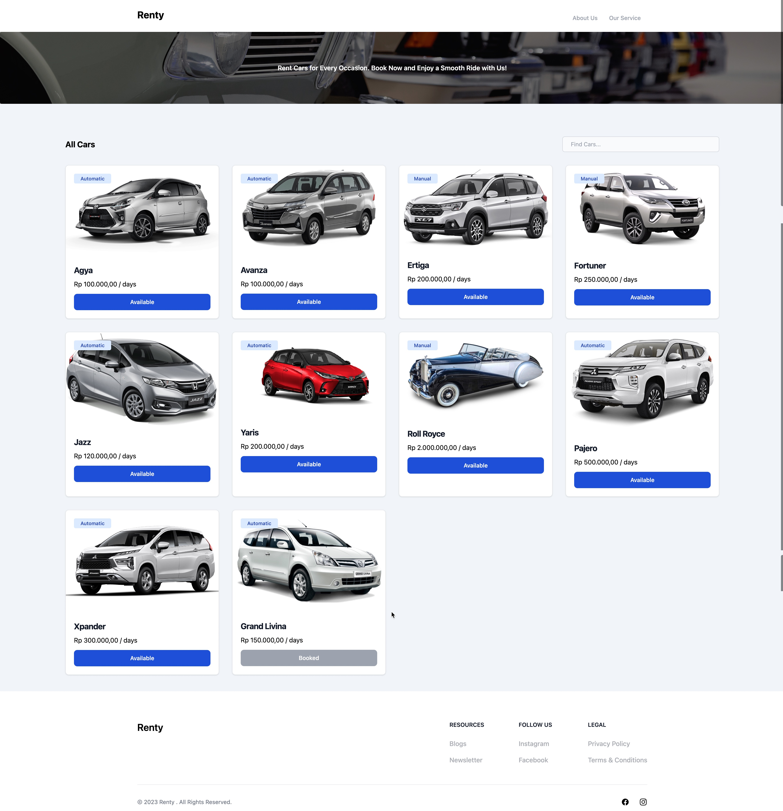

# Rent Car API

With the Rent Car API, developers can retrieve real-time data on available cars, including car name, brand, image, price, type, color, and availability status.

## Tech Stack

**Client:** React, TailwindCSS

**Server:** Laravel

## API Documentation

The REST API to the rent car app is described below.

### Get all data

```
  GET /api/rentcars
```

| Parameter | Type     | Description                                                                            |
| :-------- | :------- | :------------------------------------------------------------------------------------- |
| `limit`   | `string` | **Optional**. To determine the number of results to be returned from the Rentcar model |
| `type`    | `string` | **Optional**. To find what type of the car, is it `automatic` or `manual`              |
| `q`       | `string` | **Optional**. To find car by name                                                      |

### Get Spesific Car

```
  GET /api/rentcars/{id}
```

| Parameter | Type     | Description                              |
| :-------- | :------- | :--------------------------------------- |
| `id`      | `string` | **Required**. To find spesific car by id |

### Add Car Data

```
  POST /api/rentcars/
```

| Parameter  | Type     | Status                                                                                                              |
| :--------- | :------- | :------------------------------------------------------------------------------------------------------------------ |
| `car_name` | `string` | **Required**                                                                                                        |
| `merk`     | `string` | **Required**                                                                                                        |
| `image`    | `file`   | **Required**. Must be image                                                                                         |
| `price`    | `string` | **Required**. Must be int                                                                                           |
| `type`     | `string` | **Required**. there are 2 values that can be entered like `Automatic` oe `Manual` case sensitive must be Capitalize |
| `color`    | `string` | **Required**.                                                                                                       |
| `status`   | `string` | **Required**. there are 2 values that can be entered like `Booked` oe `Available` case sensitive must be Capitalize |

## How to clone ?

**Backend**

- Clone this project using https or ssh
- So the api is using Laravel

```
composer install
npm install
```

- Copy `.env.example` file to `.env` on the root folder. You can type copy `.env.example .env` if using command prompt Windows or cp `.env.example .env` if using terminal, Ubuntu
- adjust the values that are in the `env` file like db name, db username, db password
- Set key in `.env` using `php artisan key:generate`
- Migrate database using `php artisan migrate`
- After everything has been set, the final step is to type the code below

```
php artisan serve
```

**Frontend**

- To install react js package using this code

```
npm install
```

## Screenshots




## Authors

- [Muhammad Nurul Afif Maliki](https://www.github.com/mafif21)
- [Andrian Saputra](https://www.github.com/mafif21)
- [Alvin Renaldy Novanza](https://www.github.com/mafif21)
- [Adnan Nauli Harahap](https://www.github.com/mafif21)
- [Muhammad Rayhan Kurniawan](https://www.github.com/mafif21)
